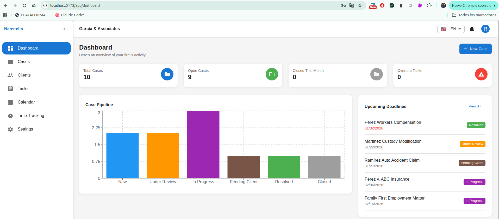

# Neostella

<div align="center">


**A modern legal case management system for law firms**

[Features](#features) • [Installation](#installation) • [Usage](#usage) • [Documentation](#documentation) • [Testing](#testing)

</div>

---

## Overview

Neostella is a comprehensive legal case management system designed for law firms to efficiently manage cases, clients, tasks, and time tracking. Built with modern web technologies, it provides a responsive and intuitive interface with role-based access control.

<div align="center">

</div>

## Features

### Case Management
- Create, edit, and track legal cases through customizable workflows
- Assign cases to multiple team members
- Track case status with defined transitions
- Set deadlines and priorities
- Complete audit trail of all activities

### Client Management
- Manage individual and business clients
- Link clients to multiple cases
- Track client history and case associations

### Task Management
- Create tasks linked to specific cases
- Assign to team members with deadlines
- Priority levels: Low, Medium, High, Urgent
- Track completion status

### Time Tracking
- Log billable and non-billable hours
- Daily, weekly, and monthly reports
- Per-case time summaries

### Dashboard & Analytics
- Real-time case pipeline visualization
- Pending and overdue task alerts
- Recent activity feed
- Key metrics at a glance

### Calendar
- View case and task deadlines
- Monthly navigation
- Visual deadline tracking

### User Management
- Role-based access control (Admin, Attorney, Paralegal)
- Granular permission system
- User activation/deactivation

### Internationalization
- English and Spanish language support
- Automatic browser language detection

## Tech Stack

| Category | Technologies |
|----------|-------------|
| **Frontend** | React 19, TypeScript 5.9, Vite 7 |
| **UI Library** | Material-UI 7, Emotion |
| **State Management** | React Context API, useReducer |
| **Routing** | React Router DOM 7 |
| **Charts** | Recharts |
| **Date Handling** | date-fns |
| **i18n** | i18next |
| **Testing** | Vitest, React Testing Library |

## Installation

### Prerequisites

- Node.js 18+
- npm 9+

### Setup

```bash
# Clone the repository
git clone https://github.com/yourusername/neostella.git
cd neostella

# Install dependencies
npm install

# Start development server
npm run dev
```

The application will be available at `http://localhost:5173`

### Demo Credentials

| Role | Email | Password |
|------|-------|----------|
| Admin | admin@neostella.com | admin123 |
| Attorney | john.smith@neostella.com | attorney123 |
| Paralegal | maria.garcia@neostella.com | paralegal123 |

## Usage

### Available Scripts

```bash
# Development
npm run dev          # Start dev server with hot reload

# Building
npm run build        # Type check and build for production
npm run preview      # Preview production build

# Testing
npm test             # Run tests in watch mode
npm run test:run     # Run tests once
npm run test:coverage # Generate coverage report
npm run test:ui      # Open Vitest UI

# Code Quality
npm run lint         # Run ESLint
```

## Project Structure

```
src/
├── components/          # Reusable UI components
│   ├── common/         # Generic components (StatusChip, PageHeader, etc.)
│   ├── features/       # Feature-specific components
│   └── layout/         # Layout components (Header, Sidebar)
├── contexts/           # React Context providers
│   ├── AuthContext     # Authentication state
│   └── AppContext      # Application data state
├── hooks/              # Custom React hooks
├── pages/              # Route page components
├── constants/          # Constants and configuration
├── services/           # Business logic and storage
├── types/              # TypeScript type definitions
├── utils/              # Utility functions
├── locales/            # i18n translation files
└── theme/              # Material-UI theme configuration
```

## Documentation

Detailed documentation is available in the `/doc` directory:

- [Project Overview](doc/README.md)
- [Architecture](doc/ARCHITECTURE.md)
- [Technologies](doc/TECHNOLOGIES.md)
- [Testing Guide](doc/TESTING.md)
- [Permissions System](doc/PERMISSIONS.md)
- [Hooks & Contexts API](doc/API.md)

## Testing

The project maintains **90%+ code coverage** with comprehensive unit and integration tests.

```bash
# Run all tests
npm run test:run

# Run with coverage report
npm run test:coverage

# Run specific test file
npx vitest run src/hooks/useCases.test.ts
```

### Coverage Thresholds

| Metric | Threshold |
|--------|-----------|
| Statements | 90% |
| Branches | 85% |
| Functions | 90% |
| Lines | 90% |

## Role-Based Access Control

| Feature | Admin | Attorney | Paralegal |
|---------|:-----:|:--------:|:---------:|
| View all cases | ✓ | | |
| View assigned cases | ✓ | ✓ | ✓ |
| Create/edit cases | ✓ | ✓ | |
| Delete cases | ✓ | | |
| Manage clients | ✓ | ✓ | |
| Complete tasks | ✓ | ✓ | ✓ |
| View time entries | ✓ | Own | Own |
| User management | ✓ | | |
| System settings | ✓ | | |

## Contributing

1. Fork the repository
2. Create a feature branch (`git checkout -b feature/amazing-feature`)
3. Commit your changes (`git commit -m 'Add amazing feature'`)
4. Push to the branch (`git push origin feature/amazing-feature`)
5. Open a Pull Request

### Development Guidelines

- Write tests for new features
- Follow existing code style and patterns
- Update documentation as needed
- Ensure all tests pass before submitting PR

## License

This project is licensed under the MIT License - see the [LICENSE](LICENSE) file for details.

## Acknowledgments

- [Material-UI](https://mui.com/) for the component library
- [React](https://react.dev/) team for the amazing framework
- [Vite](https://vitejs.dev/) for the blazing fast build tool

---

<div align="center">
Made with ❤️ by Neostella Team
</div>
